Comenzamos creando el formulario con sus diferentes div para que luego sea más
fácil su manipulación al momento de generar el CSS y JavaScript. Una vez
generado el HTML procedemos a agregar los diferentes eventos que vayan a
funcionar al momento de validar los campos o toda la información que se presenta
en el formulario. Los eventos que más utilizaremos son: onkeypress y oninput.

Se realiza el formulario en donde se utiliza div, como recurso de manipulación,
así mismo se crean eventos funcionando al validar los campos de información

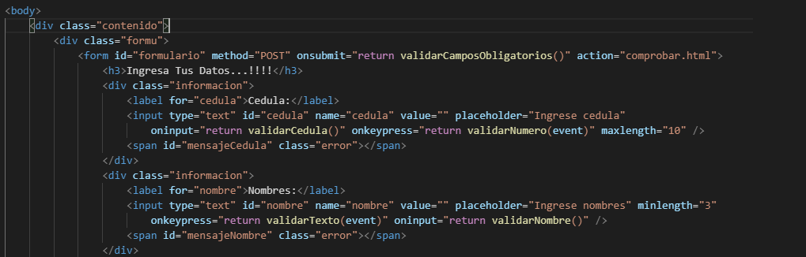

Se ejecutan las validaciones con un true y false.

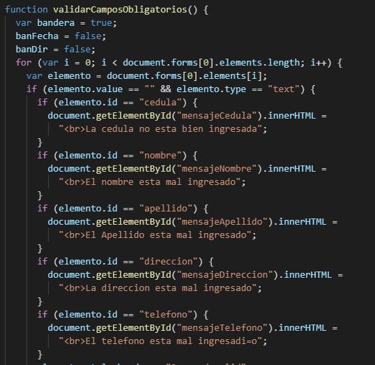

Diseñar una interfaz en HTML que permita ingresar los siguientes campos en un
formulario: cedula, nombres, apellidos, dirección, teléfono, fecha de
nacimiento, correo electrónico y contraseña.

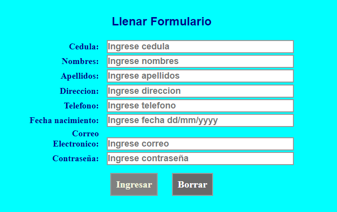

Se validan solo el ingreso de números.

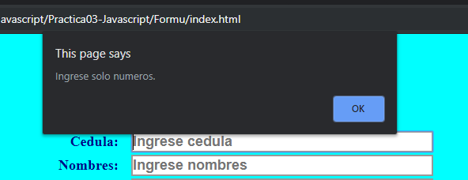

Se valida el número de cedula.

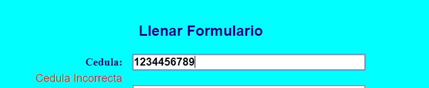

Se valida el nombre y apellido esten bien ingresados

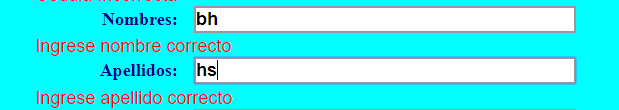

Se valida la fecha

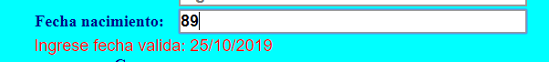

Se valida el correo sea para estudiantes y docentes ups

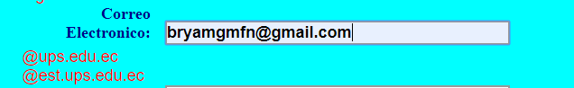

**Cuando se logra un logeo exitoso seabre la ventana**

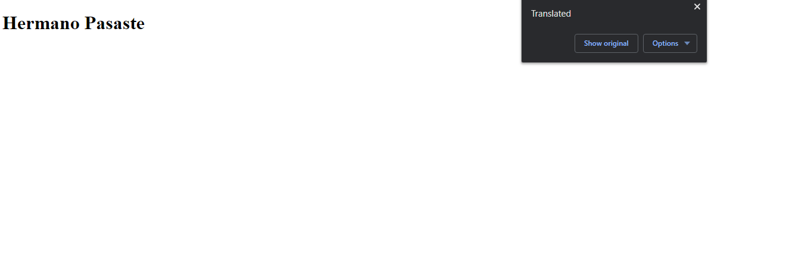

**Diseñar una interfaz en html que tenga tres botones que diga “Anterior”,
“Iniciar”, “Siguiente”, y una imagen. Luego, desde javascript se debe controlar
para al hacer clic sobre uno de los botones realice una acción relacionada a una
galería de imágenes.**

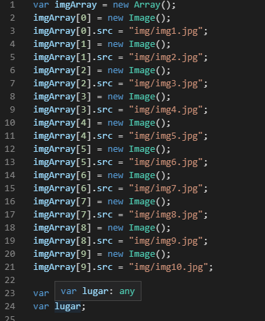

**Se ha realizado el siguiente código**

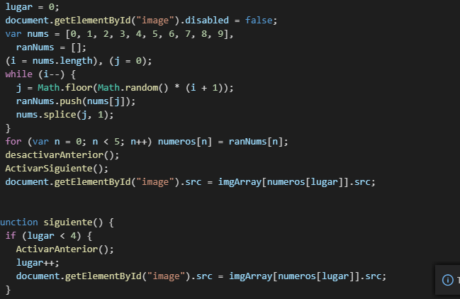

**C**omprobacion

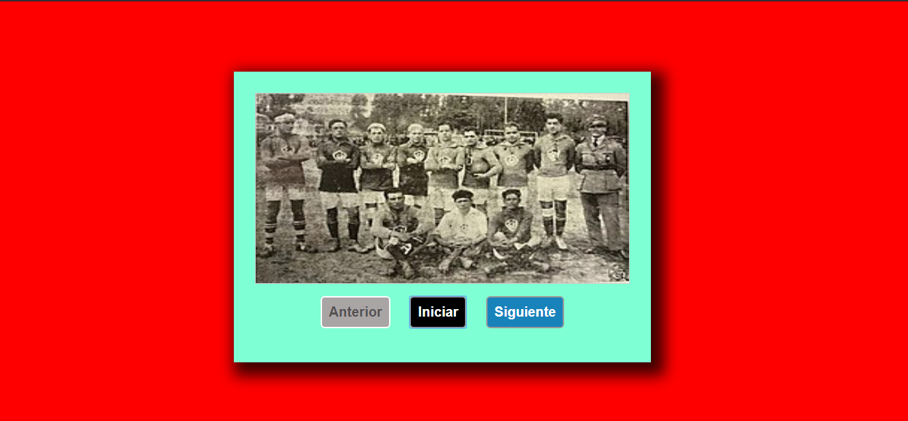

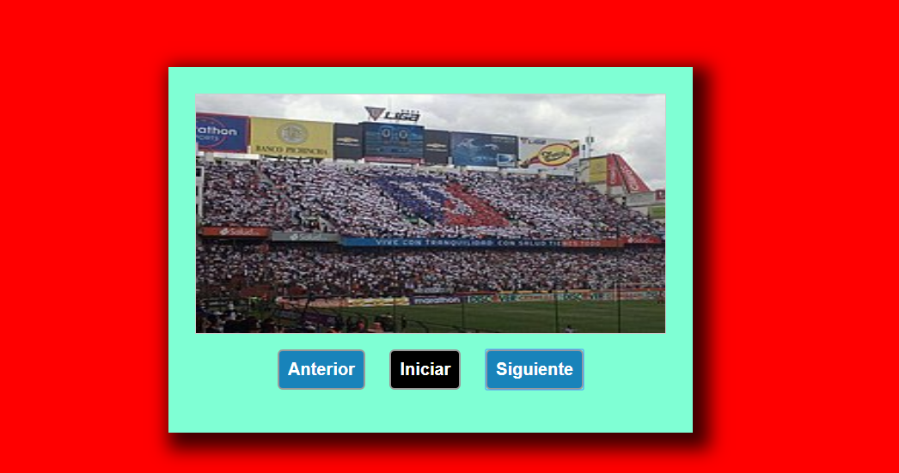

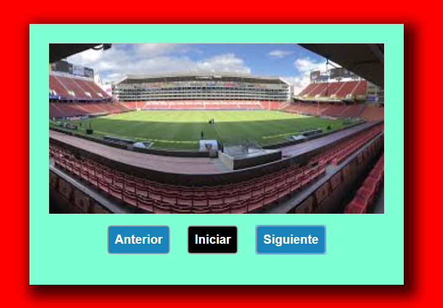

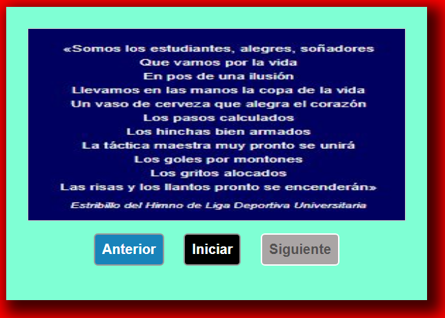

**CONCLUSIONES**:

HTML es un lenguaje por etiquetas con lo cual se debe tener en cuenta que es la
encargada de contener toda la información de una manera estructurada que para su
posterior uso esta sea fácil de distribuir.

CSS nos permite dar una forma a este lenguaje para que sea más amigable con el
usuario llegando a modificar su posición y dimensión.

JavaScript nos permite dar la funcionalidad a nuestra página para que estos
datos se puedan a llegar a interactuar con las personas

**RECOMENDACIONES**:

Cerrar todas las etiquetas.

Revisar *en* <https://validator.w3.org/#validate_by_input> para detectar un
posible error a tiempo.

Revisar el texto guía para identificar las etiquetas

**Nombre de estudiante:** Bryam Guzman

**Firma de estudiante:**

